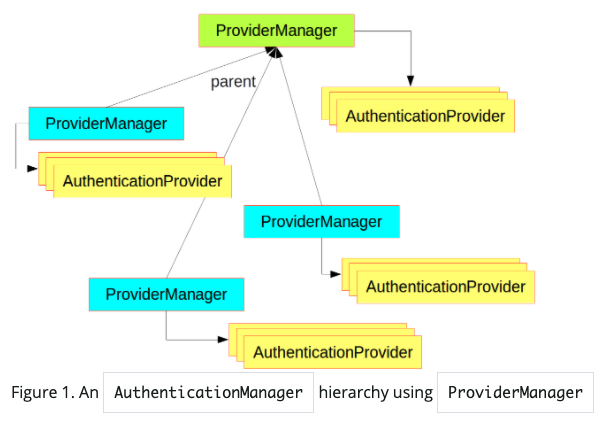
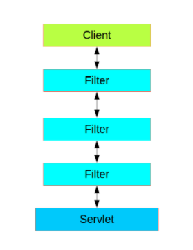
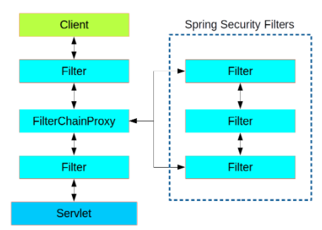

# Security 기초

스프링 시큐리티의 기본 개념은 크게 두가지로 나뉩니다.

1. authentication
2. authorization

즉, 누가, 무엇을 할것이냐..

## Authentication

인증은 AuthenticationManager 라는 인터페이스에서 처리한다.

AuthenticationManager의 구현은 보통 ProviderManager에서 하는데

ProviderManager는 AuthenticationProvider 역할을 위임한다.

ProviderManager는 다양한 인증 메커니즘을 지원할 수있다. support떄문인가봄

## AuthenticationManagerBuilder

스프링 시큐리티는 좀터 편하게 AuthenticationManager를 구현하기위해 AuthenticationManagerBuilder를 제공합니다.

## Authorization or Access Control

인증이 완료되면, 그다음 허가를 해야한다.
스프링 시큐리티에서 코어 역할로 AccessDecisionManager 가 한다.
프레임워크가 제공하는 세가지 구현과 세개의 모든 위임이 AccessDecisionVoter 체인에 제공됩니다.

AccessDecisionVoter는 Authentication과 secure Object which as been decorated with ConfigAttributes를 고려한다..

Object : 권한 레벨 ??
ConfigAttribute : 누가 액세스가능한지에 대한 정보를 가지고있음

- ConfigAttribute is the name of a user role (like ROLE_ADMIN or ROLE_AUDIT

## Web Security

웹계층에서의 시큐리티는 (HTTP 백엔드) Servlet Filter들을 베이스로 한다.

스프링 시큐리티는 하나의 Filter체인으로 구성
정확한 타입은 FilterChainProxy

## Working with Threads

스프링 시큐리티는 현재 인증된 보안 주체를 다양한 다운 스트림 소비자가 사용할 수 있어야하기 때문에 스레드 바운드이다.

## Processing Secure Methods Asynchronously

# HTTP Basic Authentication

사용자가 이름과 비밀번호를 제공
이름과 비밀번호를 합친다.
인코딩 Base64
이것을 HTTP 헤더에 넣음

1.  Provide name and password
    mike / password
2.  Name and password combined
    mike : password
3.  Encode Base64
    Znskdajskdjlkasd
4.  transmit in HTTP header
    authorization : basic Znskdajskdjlkasd
## 특징
 1. 간단하다.
 2. 전송된 내용은 암호화 되어있지 않다 (?)
 3. logout을 제공하지 않는다.
 4. 인증 메커니즘의 조작을 어플리케이션이 아닌 브라우저에의 된다.
 5. 중요하지 않은 자원에 대해 최소한의 보안을 위해 사용됨.
 6. 그냥 더 좋은 보안 솔루션을 이용해라.

# SSL & HTTPS
 HTTPS = SSL + HTTP
 HTTPS 는 HTTP를 엔드포인트에 데이터를 안전하게 보내주는 프로토콜

 ## 원리
1. Self Signed 
2. Signed by Trusted Authority

# JWT Token structure

3개의 부분으로 나뉨 (.) 으로 나뉨

1. HEADER
2. PAYLOADimport java.time.LocalDateTime;
3. SIGNATURE

Ex> eeeeee.pppppp.sssssss

