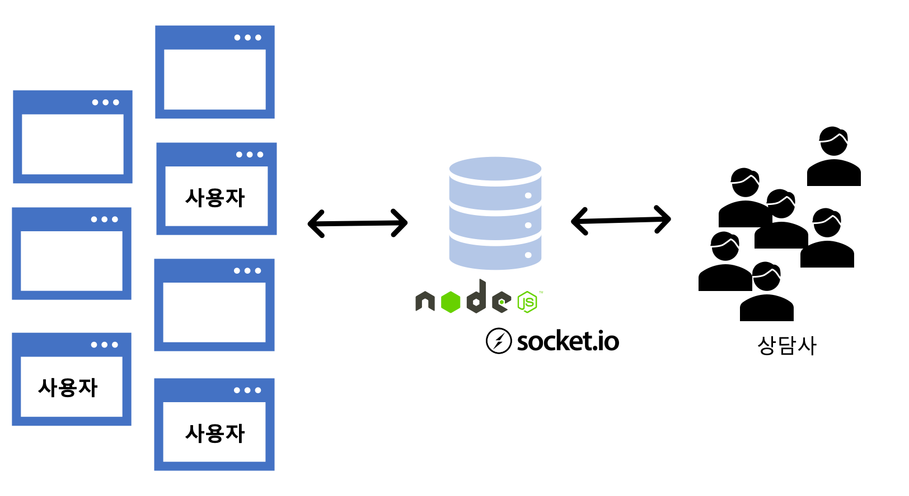
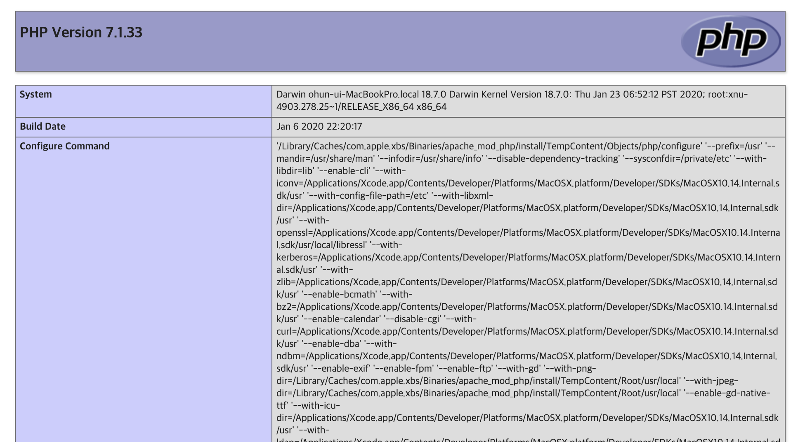
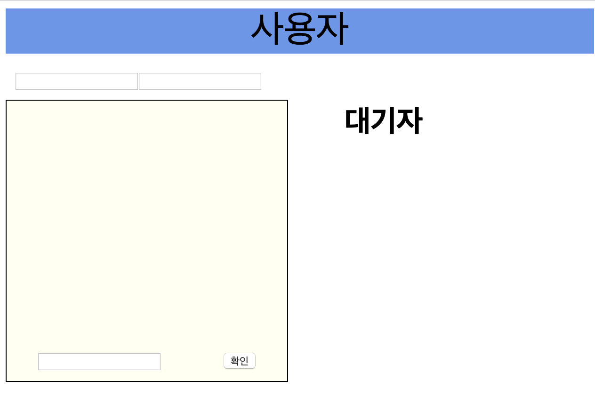
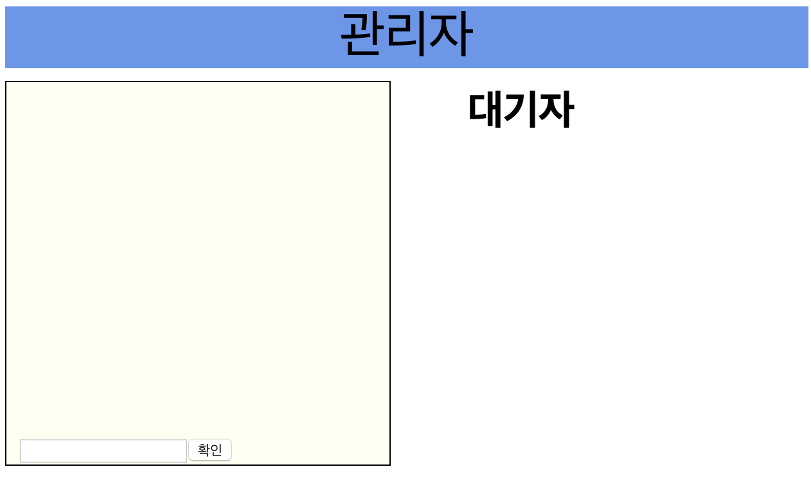

Node 및 Socket Io를 이용하여 실시간 상담 서비스어플리케이션을 구현해보도록 하겠습니다.

#### 프로그램 스펙

- 공통
  - 모든 상담 기록 저장.
- 사용자

  - 사용자는 휴대폰번호와 이름을 통해 채팅을 입력하면, 대기자 목록에 등록.
  - 현재 대기자가 몇명인자 확인 가능.
  - 이전에 상담 받았던 내용 확인.

- 상담사
  - 대기자 목록 선택시, 사용자와 매칭이 되어 상담시작.
  - 상담 매칭 시, 대기자 목록 실시간 반영이 되어 다른 상담사에게 매칭된 사용자가 안보이게 한다.

##### 대기자 계산 프로세스

##### 매칭 프로세스

#### 개발 환경설정.

기본적으로 맥에는 디폴트로 아파치와 php가 설치 되어있습니다.
하지만 활성화 시키려면 터미널로가서 활성화 시켜야하는데요.

현재 맥에 apache가 설치 되어있는지 확인하려면 아래의 명령어를 통해
현재 설치 되어있는 아파치의 버전 정보를 확인 할 수 있습니다.

```
apachectl -v
php -v
```

##### 1. 아파치 웹 서버 활성화

아파치가 설치 되어있다면, 아래의 명령어를 통해 아파치를 활성화 합니다.

```
apachectl start
```

브라우저 http://localhost/ 를 열어서 It works! 를 확인합니다.

##### 2. php 연동

이제 아파치와 php를 연동을 합니다.
기본적으로 맥에 설치된 아파치 config파일은

```
/private/etc/apache2/httpd.conf
```

경로에 위치 합니다.

httpd.conf 파일을 열어 작업할 workspace와 php 모듈을 연동합니다.
먼저 아파치는 디폴트포트가 80이므로 기존의 포트가 아닌 새로운 포트를 통해 어플리케이션을 실행 시키도록 합니다. (기존 이용하던 서비스가 있을 수 있기 때문에)

##### 2.1 81 포트 설정.

httpd 컨피그 파일에서

```
Listen 81
```

을 추가 하여 81포트를 열어둡니다.

##### 2.2 php 모듈 아파치 연동

81포트를 열고, httpd 컨피그 파일을 밑으로 내리다보면 모듈 리스트 들이 있는데요. 대부분 기본적으로 '#'으로 막혀져 있습니다.
php모듈역시 아래쪽에 존재하는데요. 해당 라인의 '#'을 없애어 모듈을 로드시킵니다.

```
LoadModule php7_module libexec/apache2/libphp7.so
```

##### 2.3 workspace 설정.

php 모듈까지 연결을 했다면, 이제 작업 환경 디렉토리를 설정하여야 합니다.
작업 환경까지 설정이 된다면 환경의 디렉토리 path에 URL로 접근이 가능하게 되어, 해당 path의 html페이지를 브라우저 상에 보여줄수 있습니다.

Directory 설정은 지정한 디렉토리에 있는 문서들에 어떤 서비스를 허용하고 제안할지를 설정합니다.

```
<Directory "WORK_SPACE_PATH">
    AllowOverride None
    Require all granted
    Options FollowSymLinks Multiviews //
    MultiviewsMatch Any
</>
```

###### 2.3.1 옵션 설명

Options : 모든 파일과 디렉토리들에 적용할 접근제어를 설정
Options -FollowSymLinks :
심볼릭 링크를 허용한다. 이 옵션을 지정하면 웹브라우저에서 링크파일의 경로까지도 확인 할 수 있게된다. 보안상 이 값은 설정하지 않는 것이 좋다.
Options -Multiviews :
웹브라우저의 요청에 따라 적절한 페이지로 보여준다. 웹브라우저의 종류나 웹문서의 종류에 따라서 가장 적합한 페이지를 보여줄 수 있도록하는 설정

AllowOverride : 어떻게 접근을 허락할 것인가에 대한 설정

##### 연동 테스트

php는 임의의 파일을 만들고

```
<?php
    phpinfo();
?>
```

위와 같이 저장한 후에, URL 경로상에 http://localhost:81/{file_path} 를 입력하면 아래와 같이 나와야 정상 동작하는 것입니다.


#### 사용자 페이지 구현

##### chat_user.php



<코드설명 필요>
<로직 및 css설명>

#### 상담사 페이지 구현

##### chat_adviser.php


<코드설명 필요>
<로직 및 css설명>

#### 채팅 서버 구현.

##### App.js

```
var express = require('express');
var commonData = require('./commonData')

var app = express();
var server = require('http').createServer(app);
var io = require('socket.io')(server).listen(45124);
var id = "vof-chat";

io.sockets.on('connection',function(socket) {

  socket.on(id, function(data) {
    var ch = "CHAT" + "_COUNSELOR";
    let nm = data.nm;
    let mn = data.mn;

    // 유저의 이름+"|"+번호 이다.
    let uniqKey = data.uniqKey;

    socket.join( ch );
    switch ( data.type ) {
      case "CHATTING":
        // 모든 채팅 정보는 브로드캐스트로 채널 전체에 반환
          // 각각 매칭된 사용자만의 메시지만 필터하여 저장, uniqueKey가 매칭된 유저의 메시지를 받기 위해 사용
        socket.broadcast.to(ch).emit(
            id, {
              type:"CHATTING", uniqKey: data.uniqKey, ms:data.ms, flag:"CHATTING", fid:data.fid, tid:data.tid, hp:data.hp, cate:data.cate
        });
        break;
      case "NEW":
        // 사용자가 첫 대화를 입력하면 대기자 명단에 추가됨
          // 채널 전체에 대기자 정보를 최신화하여 반환
        commonData.addUser(nm,mn,socket.id);
        io.emit(
            id, {
              type:"WAITING", waitotolcount : commonData.getTotalCount(), waitingList: commonData.getUsers()
            });
        break;
      case "MATCHING":
        // 관리자가 대기자를 선택했을때 채널 모두에게 현재 대기자 정보를 알려준다.
        // 선택한 대기자를 데이터 캐시에서 지운다.
        var data = commonData.matchingUser(uniqKey);
        io.emit(
            id, {
              type:"WAITING", waitotolcount : commonData.getTotalCount(), waitingList: commonData.getUsers()
            });
        break;
      default:
        // 디폴트
          // 사용자 또는 관리자가 접속할 시 디폴트로 접속한 대상에게 대기자 명단과 인원수를 반환.
          // socket.emit은 호출한 소켓에만 전달할 때 사용.
        console.log("접속");

        socket.emit(
            id, {
              type:"WAITING", waitotolcount : commonData.getTotalCount(), waitingList: commonData.getUsers()
            });
        break;
    }
  });

});

module.exports = app;

```

서버는 Node js express를 기반의 socket라이브러리를 사용하여 구현하였습니다.

<코드설명 필요>

##### commonData.js

```
var commonData = {
  "totolcount" : 0,
  "user_info" : []
}

function getTotalCount() {
  return commonData.totolcount;
}

function addUser(nm, mn, user) {
  let newUser = {
    key :'',
    value : ''
  }
  newUser.key = nm + "|" + mn;
  newUser.value = user;

  commonData['user_info'].push(newUser);
  commonData.totolcount = getTotalCount()+1;
  return user;
}

function getUsers() {
  return commonData.user_info;
}

function matchingUser(uniqKey) {
  commonData.user_info = commonData.user_info.filter( (value, index) => {
    return value.key !== uniqKey.toString();
  })

  console.log(commonData.user_info)
  return  commonData.user_info;
}


module.exports = {
  getTotalCount : getTotalCount,
  getUsers : getUsers,
  matchingUser : matchingUser,
  addUser : addUser,
  sessionKey : sessionKey
};

```
